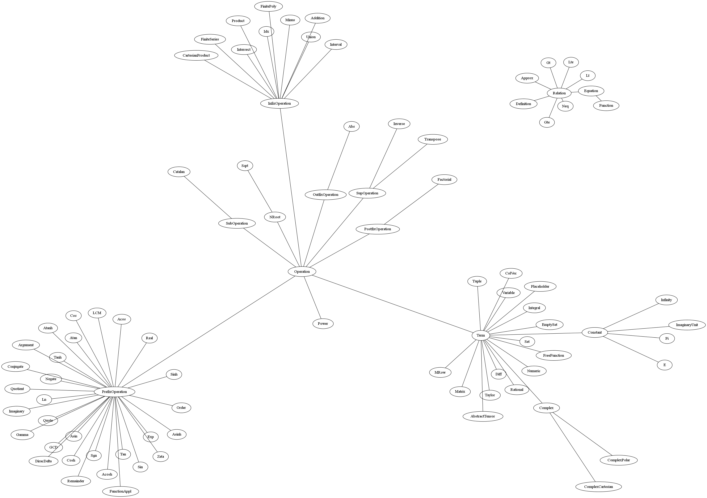

===================================
 Base - Objects
===================================

.. contents::
    :local:
.. currentmodule:: wise.packages.base.objects

Term
----------

.. automodule:: wise.packages.base.term
    :members:
    :undoc-members:
    :show-inheritance:

Primitives
----------

.. automodule:: wise.packages.base.objects
    :members:
    :undoc-members:
    :show-inheritance:

Operations
----------

.. automodule:: wise.packages.base.operations
    :members:
    :undoc-members:
    :show-inheritance:

Toplevel Elements
-----------------

.. automodule:: wise.packages.base.toplevel
    :members:
    :undoc-members:
    :show-inheritance:

Cells
-----

.. automodule:: wise.packages.base.cell
    :members:
    :undoc-members:
    :show-inheritance:

