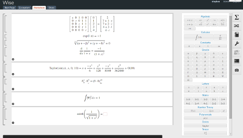

Overview
================================

Wise is an experimental web-based notebook and simple computer algebra system.

    The goal of the Wise project is to provide an interactive mathematical
    scratch pad that makes manipulating symbolic expressions fast, accessible,
    and extensible.

Wise is a bottom-up approach to symbolic math written entirely in C and Python.
Namely it does not depend on any external math software or libraries such as
(Maxima, Axiom, Mathematica, etc). The symbolic algorithms are all written in
the `Pure programming language <http://code.google.com/p/pure-lang>`_.

Wise has a 2D input system which uses MathML to render
interactive expressions directly in the browser.

Screenshot
----------

Download
--------

You can download this project in either zip or tar formats::

https://github.com/sdiehl/wise/archives/master

You can also clone the project with Git by running::

    $ git clone git://github.com/sdiehl/wise
